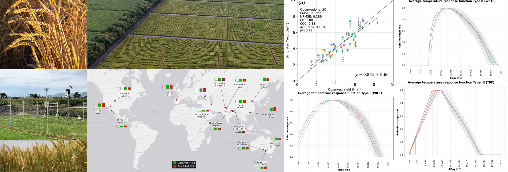

<p align="center">
  <!-- <a href="https://orderseed.cimmyt.org/iwin-results.php"></a> -->
  <a href="https://github.com/egiron/TemperatureFunct/actions"></a>
  <a href="https://pypistats.org/packages/tfunct"></a>
  <a href="https://pypi.org/project/tfunct"></a>
  <a href="https://opensource.org/licenses/"></a>
  
</p>

# Welcome to Temperature Response Functions

This is a small package for estimating wheat yield. it estimates yield under non-stressed and VPD stressed conditions as a function of temperature.

Authors: 

* Azam Lashkari (azam.lashkari@jic.ac.uk)
* Urs Christoph Schulthess (U.Schulthess@cgiar.org)
* Carlo Montes (c.montes@cgiar.org)
* Ernesto Giron E. - (e.giron.e@gmail.com)

Reference:

* _Lashkari et al. Vapor pressure deficit adds little to temperature-based explanations of irrigated wheat yield prediction.

_


## Quick start

The package for temperature response functions can be installed with `pip`:

``` sh
pip install tfunct
```

For detailed installation instructions, configuration options, and a demo, visit
[installation]

  [installation]: https://egiron.github.io/TemperatureFunct/


# License

**MIT License**

Copyright (c) 2021-2025 

Permission is hereby granted, free of charge, to any person obtaining a copy
of this software and associated documentation files (the "Software"), to
deal in the Software without restriction, including without limitation the
rights to use, copy, modify, merge, publish, distribute, sublicense, and/or
sell copies of the Software, and to permit persons to whom the Software is
furnished to do so, subject to the following conditions:

The above copyright notice and this permission notice shall be included in
all copies or substantial portions of the Software.

THE SOFTWARE IS PROVIDED "AS IS", WITHOUT WARRANTY OF ANY KIND, EXPRESS OR
IMPLIED, INCLUDING BUT NOT LIMITED TO THE WARRANTIES OF MERCHANTABILITY,
FITNESS FOR A PARTICULAR PURPOSE AND NON-INFRINGEMENT. IN NO EVENT SHALL THE
AUTHORS OR COPYRIGHT HOLDERS BE LIABLE FOR ANY CLAIM, DAMAGES OR OTHER
LIABILITY, WHETHER IN AN ACTION OF CONTRACT, TORT OR OTHERWISE, ARISING
FROM, OUT OF OR IN CONNECTION WITH THE SOFTWARE OR THE USE OR OTHER DEALINGS
IN THE SOFTWARE.


Copyright (c) 2025 International Maize and Wheat Improvement Center (CIMMYT)
