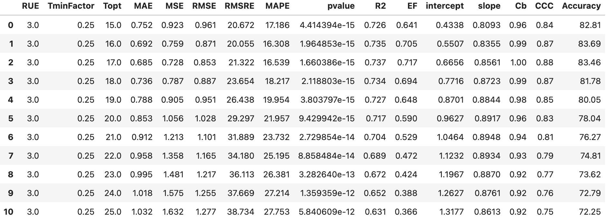
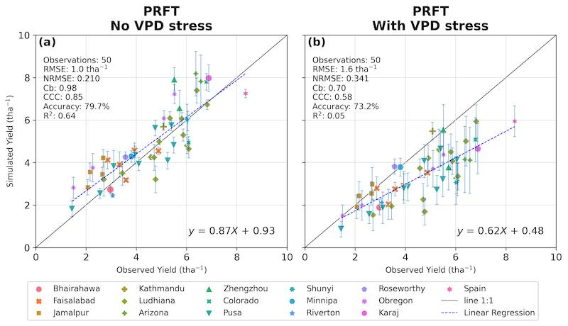

<!-- ---
hide:
  - navigation
  #- toc
--- -->

## Estimating grain yield using several combinations in models

To establish the optimum temperature response for grain-filling period, you can run several models using a wide range of cardinal temperatures. 

!!! quote "Optimum temperature"
    The optimum temperature for photosynthesis depends on the choosen temperature function.

### PRFT combinations for none stress conditions
``` python
functype='PRFT'
isVPDStress=False
df_GYield, data_input, cols = model.setup_dataInput_forCombinations(sites) # Setup input data
# Combinations
RUE = [3.0] #[2.8, 2.9, 3.0, 3.1, 3.2]
Topt = [x for x in range(15, 26)]
TminFactor = [0.25] #[0.0, 0.1, 0.2, 0.25, 0.3, 0.4, 0.5]
# No stress conditions
array_params_to_run, array_results = model.getCombinations(functype=functype, cols=cols, RUE=RUE, Topt=Topt, 
                                                     TminFactor=TminFactor, isVPDStress=isVPDStress)

cmb_PRFT_noStress = model.getGYield_forCombinations(functype, df_GYield, data_input, array_params_to_run, 
                                           isVPDStress, array_results, saveFile=True)
```

#### Metrics for evaluation
``` python
m_PRFT_noStress = model.getCombinations_Metrics(functype, isVPDStress, df_GYield, 
                                                 array_params_to_run, array_results, saveFile=True) #, fmt='parquet')
m_PRFT_noStress
```


### PRFT combinations for stressed Vapor pressure deficit (VPD) condition

``` python
functype='PRFT'
isVPDStress=True
df_GYield, data_input, cols = model.setup_dataInput_forCombinations(sites) # Setup input data
# Combinations
RUE = [3.0]
Topt = [x for x in range(15, 26)]
TminFactor = [0.25] #[0.0, 0.1, 0.2, 0.25, 0.3, 0.4, 0.5]
Lvpd = [0.5, 1, 1.5, 2, 2.5, 3, 3.5]
Uvpd = [1, 1.5, 2, 2.5, 3, 3.5, 4]
SFvpd_Lthres = [0.2, 0.4, 0.6, 0.8] 
SFvpd_Uthres = [1]
# No stress conditions
array_params_to_run, array_results = model.getCombinations(functype=functype, cols=cols, RUE=RUE, Topt=Topt, TminFactor=TminFactor,  
                                                           Lvpd=Lvpd, Uvpd=Uvpd, SFvpd_Lthres=SFvpd_Lthres, SFvpd_Uthres=SFvpd_Uthres,
                                                           isVPDStress=isVPDStress)

cmb_PRFT_SFvpd = model.getGYield_forCombinations(functype, df_GYield, data_input, array_params_to_run, 
                                           isVPDStress, array_results, saveFile=True)
``` 

#### Metrics for VPD stress condition
``` python
m_PRFT_SFvpd = model.getCombinations_Metrics(functype, isVPDStress, df_GYield, 
                                                 array_params_to_run, array_results, saveFile=True)
m_PRFT_SFvpd
```


### Display grain yield comparison with and without VPD stress
``` python
figures.plot_corrTempFunct(cmb_noStress=cmb_PRFT_noStress, cmb_noStress_filtered=cmb_PRFT_noStress, 
                   cmb_SFvpd=cmb_PRFT_SFvpd, cmb_SFvpd_filtered=cmb_PRFT_SFvpd,
                   functype='PRFT',fld1='ObsYield',fld2='SimYield',hue='location', ncol=6, s=20, alpha=0.65, xy_lim=1, 
                   fonts_axes=10, fonts_titles=12, dispScore=True, errorbar=False, saveFig=True, showFig=True,
                   path_to_save_results=path_to_save_results, dirname='Figures', fname='Fig_2_nofilters', fmt='jpg')
```


``` python
figures.plot_corrTempFunct(cmb_noStress=cmb_PRFT_noStress, cmb_noStress_filtered=cmb_PRFT_noStress, 
                   cmb_SFvpd=cmb_PRFT_SFvpd, cmb_SFvpd_filtered=cmb_PRFT_SFvpd,
                   functype='PRFT',fld1='ObsYield',fld2='SimYield',hue='location', ncol=6, s=80, alpha=0.95, xy_lim=1, 
                   fonts_axes=10, fonts_titles=12, dispScore=True, errorbar=True, saveFig=True, showFig=True,
                   path_to_save_results=path_to_save_results, dirname='Figures', fname='Fig_2_nofilters_errorbar', fmt='jpg')
```



## Conclusion


!!! success "Congratulations"

    You have run a simulation using a prebuilt dataset and the [Temperature Functions API](reference/index.md).


[Next: Validating models](evaluating.md){ .md-button}


