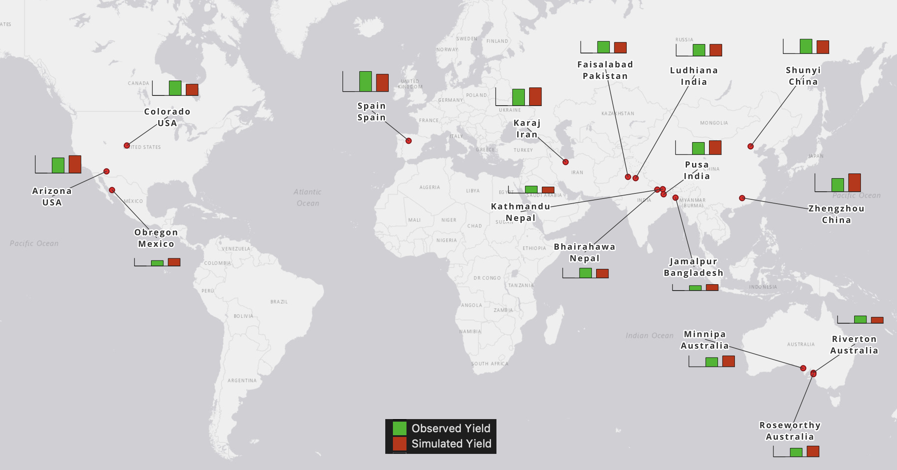
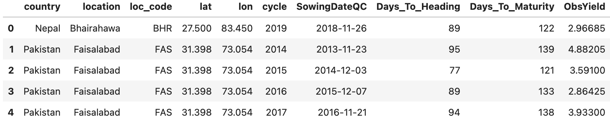
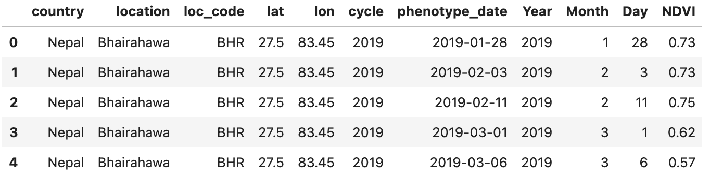
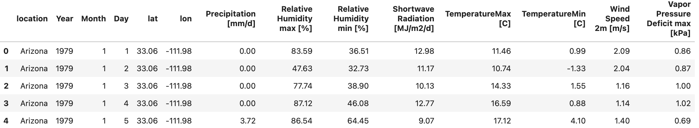

<!-- ---
hide:
  - navigation
  #- toc
--- -->
# DATA

We analyse how different temperature functions and VPD thresholds affects non-water stress wheat yield across the International Wheat Improvement Network (IWIN) sites and the other locations across the globe.



The data from 50 site-year experiments was assembled for this analysis. The phenology, vegetation indexes and daily weather data is used as input for the yield algorithms.

## Phenology data

Crop data for Nepal (Kathmandu and Bhairahawa), Bangladesh (Jamalpur), India (Pusa and Ludhiana) and Pakistan (Faisalabd) collected from advanced spring wheat breeding lines from CIMMYT’s South Asia Bread Wheat Genomic Prediction Yield Trials planted between 2013 to 2021 (_Phenotyping and meta-GWAS for grain yield, heat tolerance, resistance to yellow rust and spot blotch, relevant to smallholder farmers growing wheat on 40 million ha in South Asian countries Project_). Data for China (Zhengzhou and Shunyi), Australia (Minnipa, Riverton, Roseworthy), Iran (Karaj), Arizona, Colorado, Spain and Mexico (Obregon) were collected from different experiments.  In addition, late sowing trials (high temperature experiments) from Ludhiana, Pusa and Obregon were added to the analysis to investigate the role of high temperatures and high VPD.

## NDVI data

NDVI data (measured by GreenSeeker) from heading to maturity and their corresponding yield data were collected from different experiments across the world.

## Wheat canopy temperature data

Dataset of daily canopy temperature and meteorological data from the ECMWF’s AgERA5 product for the period 1979 though 2020, and for ~785 points belonging to the International Wheat Improvement Network (IWIN). Data available at 
[CIMMYT dataverse].

<!-- [IWIN]: https://orderseed.cimmyt.org/iwin-results.php -->
 [CIMMYT dataverse]: https://data.cimmyt.org/dataset.xhtml?persistentId=hdl:11529/10548626

## Weather Data

The last generation of [ERA5] global atmospheric reanalysis weather data is used. This product is generated by the European Centre for Medium-Range Weather Forecasts ([ECMWF]) and is provided both at an hourly and monthly time scale, with a horizontal resolution of 0.1° x 0.1° (~10 km), covering the period 1979 to present (Hersbach et al., 2020).

 [ECMWF]: https://www.ecmwf.int/
 [ERA5]: https://cds.climate.copernicus.eu/cdsapp#!/dataset/10.24381/cds.6c68c9bb?tab=overview


## Loading datasets using the API

All of the above data can be loaded and displayed using the library API.

``` python
from tfunct.data import load_dataset # Function to load existing dataset
# Load example dataset (Phenology, NDVI and Weather data for each site)
data = load_dataset()
# Display available datasets
print(data.keys()) # ['Pheno', 'NDVI', 'Weather']
# Display Phenology
data['Pheno'].head()

```


``` python
# Display NDVI
data['NDVI'].head()
```


``` python
# Display Weather
data['Weather'].head()
```


References:

- Montes, Carlo; Schulthess, Urs; Lashkari, Azam, 2021, "Daily wheat canopy temperature and meteorological data for IWIN locations", https://hdl.handle.net/11529/10548626, CIMMYT Research Data & Software Repository Network, V1

- Boogaard, H., Schubert, J., De Wit, A., Lazebnik, J., Hutjes, R., Van der Grijn, G., (2020): Agrometeorological indicators from 1979 to present derived from reanalysis. Copernicus Climate Change Service (C3S) Climate Data Store (CDS). DOI: 10.24381/cds.6c68c9bb (Accessed on 23-Sep-2023)
