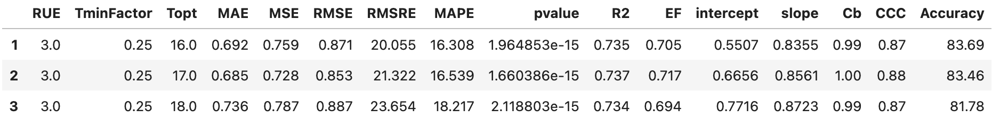
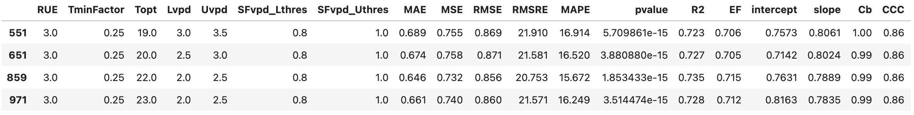
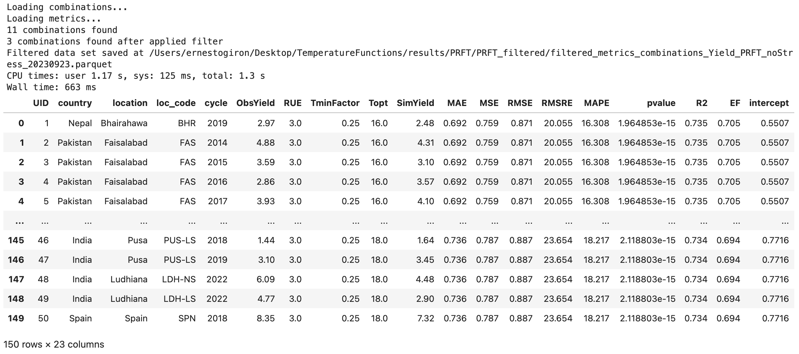
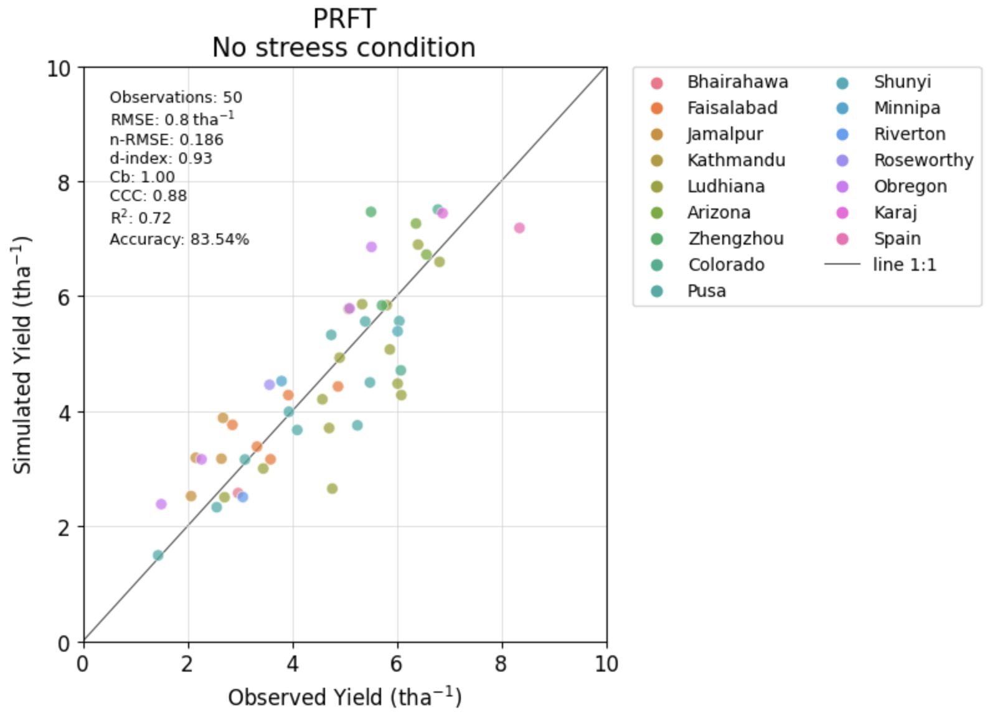
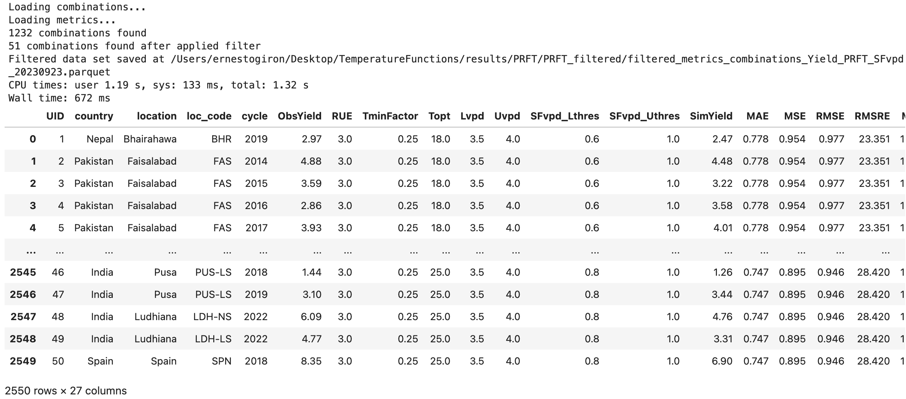
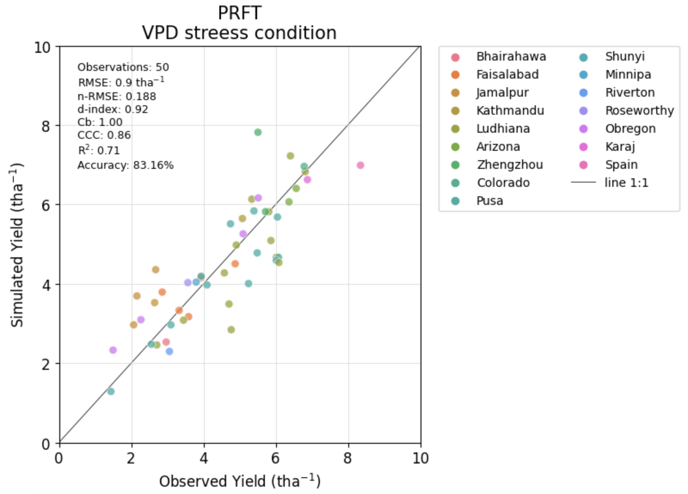
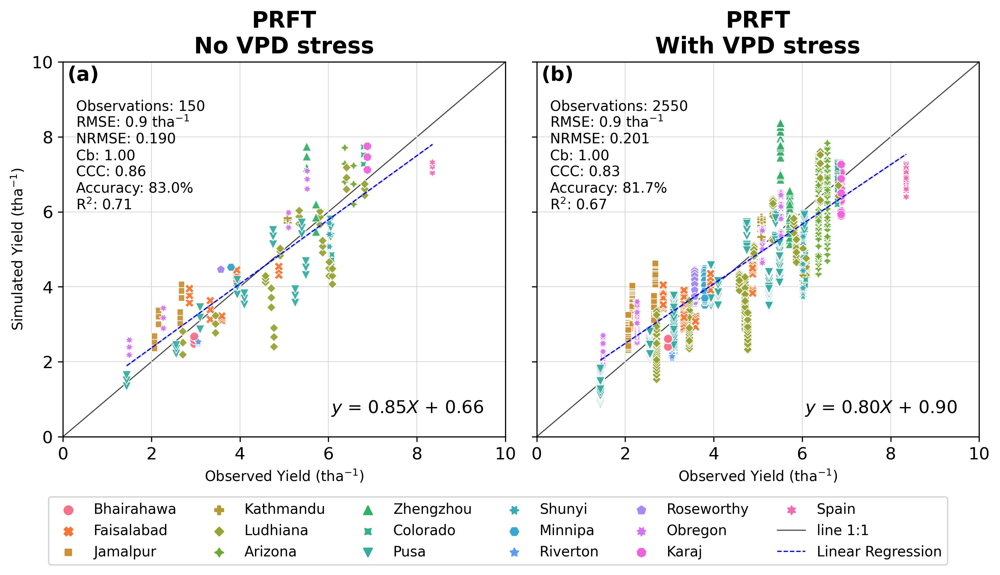
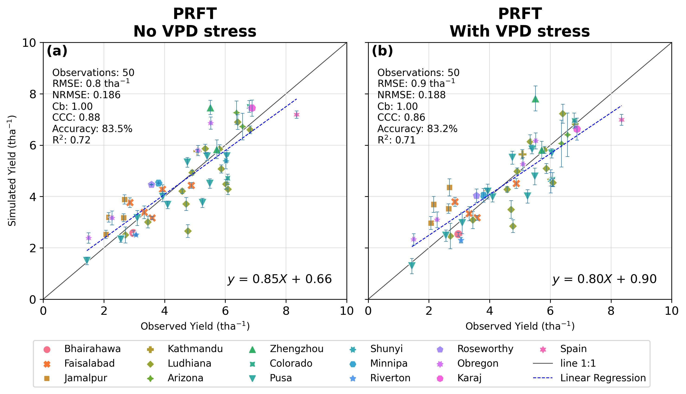

<!-- ---
hide:
  - navigation
  #- toc
--- -->

## Select the best results using filters

After running several models you can filter results to see which one look better. 

!!! example "Example of filter"

    The following table is an example of one filter used to evaluate the best models, it only uses three (3) evaluation metrics (_Cb, CCC, and RMSRE_) to select the top ones. 

    | Temperature Function | Cb  | CCC  |  RMSRE |   |
    |---------------------|---|---|---|---|
    | **PRFT** |  0.98 |  > 0.8 |    |   |
    | **PRFT vpd stress**|  0.98 | > 0.8  | < 22  |   |

When the combinations file is small you can filter directly in your session. For example:
``` python
m_PRFT_noStress[(m_PRFT_noStress['Cb']>0.98) & (m_PRFT_noStress['CCC']>0.80) ]
```


``` python
m_PRFT_SFvpd[(m_PRFT_SFvpd['Cb']>0.98) & (m_PRFT_SFvpd['CCC']>0.80) & (m_PRFT_SFvpd['RMSRE']<22)]
```


But when the combinations dataset is huge, you will have memory issues. Then the best way to filter the combinations in an easy way, is using the `util.filterSimulations` function, as follows:
``` python
# Load filter function to accelerate the responses
from tfunct.util import filterSimulations

```

### No stress conditions
``` python
%%time
# path of the combinations and metrics files in parquet format
c_PRFT = os.path.join(config['RESULTS_PATH'], "PRFT", "PRFT_noStress", "combinations_Yield_PRFT_noStress.parquet")
m_PRFT = os.path.join(config['RESULTS_PATH'], "PRFT", "PRFT_noStress", "metrics_Yield_PRFT_noStress.parquet")
# Filters
cmb_filters = dict(
                RUE = ('RUE', '=', 3.0 ),
                TminFactor = ('TminFactor', '=', 0.25 )
            )
met_filters = dict(
        Cb = ('>', 0.98),
        CCC = ('>', 0.80)
    )
outputPath = os.path.join(config['RESULTS_PATH'], "PRFT")

# Use pdFormat=True to display filtered table. Use when the results are small to avoid freeze you computer session
# Use fmt='parquet' and avoid fmt='csv' when the results are quite large.
# Use dispFig=True if the filtered table is small.
filtered_c_PRFT = filterSimulations(functype='PRFT', VPDstress=False, cmb=c_PRFT, met=m_PRFT, 
                                 cmb_filters=cmb_filters, met_filters=met_filters, pdFormat=True, 
                                 dispFig=True, saveFig=True, figname='Fig_topComb_avgYield', figfmt='pdf',
                                 saveResults=True, outputPath=outputPath, fmt='parquet')

filtered_c_PRFT
```



### VPD stress conditions
``` python
# Path of the combinations and metrics files
c_PRFT_SFvpd = os.path.join(config['RESULTS_PATH'], "PRFT", "PRFT_SFvpd", "combinations_Yield_PRFT_SFvpd.parquet")
m_PRFT_SFvpd = os.path.join(config['RESULTS_PATH'], "PRFT", "PRFT_SFvpd", "metrics_Yield_PRFT_SFvpd.parquet")
cmb_filters = dict(
                RUE = ('RUE', '=', 3.0 ),
                TminFactor = ('TminFactor', '=', 0.25 )
            )
met_filters = dict(
        Cb = ('>', 0.98),
        CCC = ('>', 0.80)
    )
outputPath = os.path.join(config['RESULTS_PATH'], "PRFT") 

# Use pdFormat=True to display filtered table. Use when the results are small to avoid freeze you computer session
# Use fmt='parquet' and avoid fmt='csv' when the results are quite large.
# Use dispFig=True if the filtered table is small.
filtered_c_PRFT_SFvpd = filterSimulations(functype='PRFT', VPDstress=True, cmb=c_PRFT_SFvpd, met=m_PRFT_SFvpd, 
                                 cmb_filters=cmb_filters, met_filters=met_filters, pdFormat=True, 
                                 dispFig=True, saveFig=True, figname='Fig_topComb_avgYield', figfmt='pdf',
                                 saveResults=True, outputPath=outputPath, fmt='parquet')

filtered_c_PRFT_SFvpd
```



### Checking selected combinations side-by-side

Displaying grain yield comparison with and without VPD stress for the best combinations.

``` python
figures.plot_corrTempFunct(cmb_noStress=filtered_c_PRFT, cmb_noStress_filtered=filtered_c_PRFT, 
                           cmb_SFvpd=filtered_c_PRFT_SFvpd, cmb_SFvpd_filtered=filtered_c_PRFT_SFvpd,
                   functype='PRFT',fld1='ObsYield',fld2='SimYield',hue='location', ncol=6, s=40, alpha=0.95, xy_lim=1, 
                   fonts_axes=10, fonts_titles=12, dispScore=True, errorbar=False, saveFig=True, showFig=True,
                   path_to_save_results=path_to_save_results, dirname='Figures', fname='Fig_2_filtered', fmt='jpg')
```


``` python
figures.plot_corrTempFunct(cmb_noStress=filtered_c_PRFT, cmb_noStress_filtered=filtered_c_PRFT, 
                           cmb_SFvpd=filtered_c_PRFT_SFvpd, cmb_SFvpd_filtered=filtered_c_PRFT_SFvpd,
                   functype='PRFT',fld1='ObsYield',fld2='SimYield',hue='location', ncol=6, s=80, alpha=0.95, xy_lim=1, 
                   fonts_axes=10, fonts_titles=12, dispScore=True, errorbar=True, saveFig=True, showFig=True,
                   path_to_save_results=path_to_save_results, dirname='Figures', fname='Fig_2_filtered_errorbar', fmt='jpg')
```



## Conclusion


!!! success "Congratulations"

    You have run a simulation using a prebuilt dataset and the [Temperature Functions API](reference/index.md).


