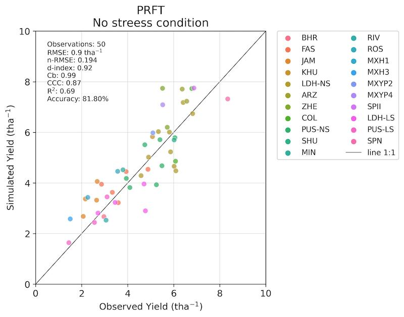
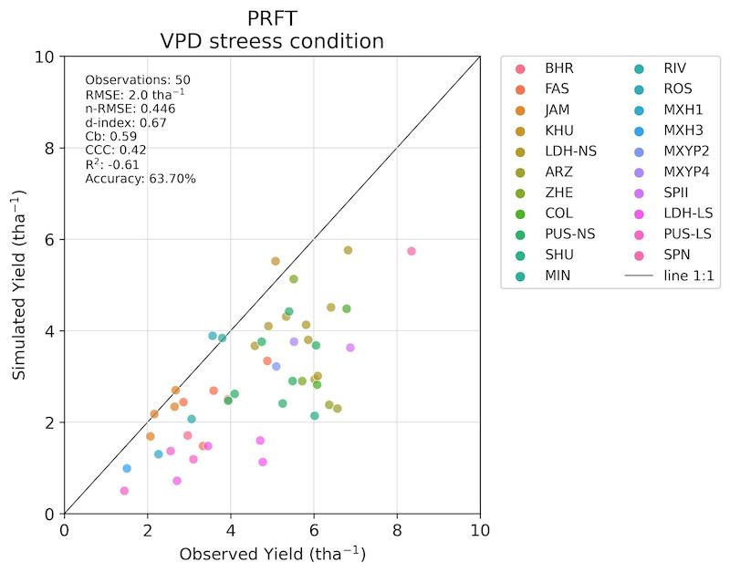
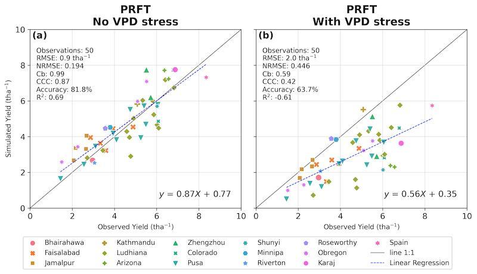

<!-- ---
hide:
  - navigation
  #- toc
--- -->
# Getting started

Here we compare three different temperature functions with different cardinal temperature combinations with and without VPD stress function for the period from heading to maturity (grain filling period). 

---

## Setup a folder

Enter a folder or subfolder of your project root where you created the python environment and activate it.
``` sh
cd <`subfolder`>
. venv/bin/activate
```
If you didn't install the `venv` yet, please review the detailed [installation instructions]

  [installation instructions]: installation.md

## Install library

Setting up temperature response functions is as simple as using the familiar `pip install` command. By executing the following line, you will have the library installed and ready to use:

``` sh
pip install tfunct
```

### Verify install
``` sh
python3 -c "import tfunct; print(tfunct.__version__)"
```

If a version similar to `tfunct version 1.0.0` is returned, you've installed the package successfully.
!!! Success  "Success: Temperature Response Functions package is now installed."

---

???+ example "View Sample quickstart for beginners"

    To get started with temperature response functions, we need to create a project folder and install a python virtual environment for our packages and further analysis as follows:
    
    === "macOS/Linux/Unix"

      ```sh
      mkdir TFUNCT_Project_2023;cd TFUNCT_Project_2023;
      python3 -m venv venv
      . venv/bin/activate
      pip install tfunct
      python3 -c "import tfunct; print(tfunct.__version__)"
      ```

???+ info "Google Colab"
    ### An easy way to learn and use temperature response functions package

    No install necessary, run the temperature response functions [tutorials] directly in the browser with [Colaboratory], a Google research project created to help disseminate machine learning education and research. It's a [Jupyter notebook] environment that requires no setup to use and runs entirely in the cloud.

      [tutorials]: #
      [Colaboratory]: https://colab.research.google.com/notebooks/welcome.ipynb
      [Jupyter notebook]: https://jupyter.org/

---

Note: this tutorial is also available as a single python notebook. You can download it on Github below:

[Download Python Notebook](#){ .md-button .md-button--primary}

Once tfunct library is successfully installed, you can import the essential modules for dataset creation and data pre-processing.

## Load a dataset <small>recommended for beginners</small> { #Load-a-dataset data-toc-label="Load a dataset" }

Load and prepare the trial dataset. 

### Loading the data { #loading-the-data data-toc-label="loading the data"}

Example dataset can be loaded directly from the library, as follows:

``` py hl_lines="2 4"
import tfunct
from tfunct.data import load_dataset # Function to load existing dataset
# Load example dataset (Phenology, NDVI and Weather data for each site)
data = load_dataset()
# Display available datasets
print(data.keys()) # ['Pheno', 'NDVI', 'Weather']
# Display Phenology
data['Pheno'].head()
```


``` python
# Display NDVI
data['NDVI'].head()
```


``` python
# Display Weather
data['Weather'].head()
```


## Creating a model

The model contains all of the required functions to analyse the data

``` python
# Load module to create a model
from tfunct.model import Model

# ------------------------
# MODEL CONFIGURATION
# ------------------------
# Define the Path where the output data will be stored
PATH_PRJ = '/Users/ernestogiron/Desktop/TemperatureFunctions/'
RESULTS_PATH = PATH_PRJ + 'results/'

config = {
    "PROJECT_PATH": PATH_PRJ,
    "RESULTS_PATH": RESULTS_PATH, #'./', # Results will be put in the same folder where the model is running
}

# Parameters used by default
parameters = dict(
                RUE = 3,
                DRYMATTER = 0.8,
                FACTOR_TON_HA = 0.01,
                YIELD_FACTOR = 0.8 * 0.01,
                TMIN_PERC_FACTOR = 0.25,
                NDVI_lowerThreshold = 0.16,
                Toptmin = 15,
                Topt = 18,
                Toptmax = 25,
                Tmin = 9,
                Tmax = 34,
                Lvpd = 1,
                Uvpd = 4,
                SFvpd_Lthres = 0.2,
                SFvpd_Uthres = 1,
            )

# create model to estimate grain yield
# model = Model(config, parameters) # Use this if you change any parameter above
model = Model(config)
# Preprocess datasets
model.preprocess_raw_datasets(data)

```

## Preparing locations

Prepare dataset to run all process in parallel using NDVIA GPU if available
``` python
sites = model.prepareData()
# Check for parameters of the first site
sites[0].attributes
```
``` raw
{'country': 'Nepal',
 'location': 'Bhairahawa',
 'loc_code': 'BHR',
 'lat': 27.5,
 'lon': 83.45,
 'cycle': 2019,
 'Days_To_Heading': 89,
 'Days_To_Maturity': 122,
 'ObsYield': 2.96685,
 'Sowing_date': '2018-11-26',
 'Heading_date': '2019-02-23',
 'Maturity_date': '2019-03-28',
 'UID': 1,
 'ndays_tmn_lt9': 1,
 'ndays_tmx_gt34': 0,
 'avg_Tdaymax': 24.578,
 'avg_NDVI': 0.447,
 'avg_iPAR': 0.369}

```

## Using one of the Temperature functions

Calculating grain yield using Ritchie's Temperature-based function affecting Photosynthetic Reduction Factor ([PRFT]).

  [PRFT]: prft.md

### No stress conditions
``` python
PRFT_noStress = model.getYield(sites=sites)
PRFT_noStress.head()
```


### Stressed VPD
``` python
PRFT_SFvpd = model.getYield(sites=sites, is_VPDStress=True)
PRFT_SFvpd.head()
```


For further information about `model.getYield` visit the [API reference](reference/index.md#tfunct.model.Model.getYield).


## Displaying Grain Yield

Create a figure to compare simulated grain yield against observed. 
``` python
from tfunct.util import figures

dirname=os.path.join(config['RESULTS_PATH'], 'PRFT', 'Figures')
figures.chart_compareResults(df_result=PRFT_noStress, fld1="ObsYield", fld2="SimYield", alpha=.75, s=45, xy_lim=2, 
                             hue='loc_code', loc_leg=2, ncol=2, ha='left', va='top',
                             title='PRFT\nNo streess condition', dirname=dirname, fname='PRFT_noStress', 
                             dispScore=True, dispLegend=True, saveFig=True, showFig=True, fmt='jpg')
```


Changing the parameter `df_result` to `PRFT_SFvpd`, you can see the results for VPD stress conditions
``` python
figures.chart_compareResults(df_result=PRFT_SFvpd, fld1="ObsYield", fld2="SimYield", alpha=.75, s=45, xy_lim=2,       
                             hue='loc_code', loc_leg=2, ncol=2, ha='left', va='top',
                             title='PRFT\nVPD streess condition', dirname=dirname, fname='PRFT_SFvpd', 
                             dispScore=True, dispLegend=True, saveFig=True, showFig=True, fmt='jpg')

```



If you prefer see both figures sid-by-side in a single one to compare results, you can use the `plot_corrTempFunct` function as follows:

``` python
figures.plot_corrTempFunct(cmb_noStress=PRFT_noStress, cmb_noStress_filtered=None, 
                           cmb_SFvpd=PRFT_SFvpd, cmb_SFvpd_filtered=None,
                           functype='PRFT',fld1='ObsYield',fld2='SimYield',hue='location', 
                           ncol=6, s=80, alpha=0.95, xy_lim=1, fonts_axes=10, fonts_titles=12, dispScore=True, errorbar=True, saveFig=True, showFig=True, path_to_save_results=path_to_save_results, dirname='Figures', fname='Fig_1_errorbar', fmt='jpg')
```



## Conclusion


!!! success "Congratulations"

    You have run a simulation using a prebuilt dataset and the [Temperature Functions API](reference/index.md).


[Next: Running models](combinations.md){ .md-button}


