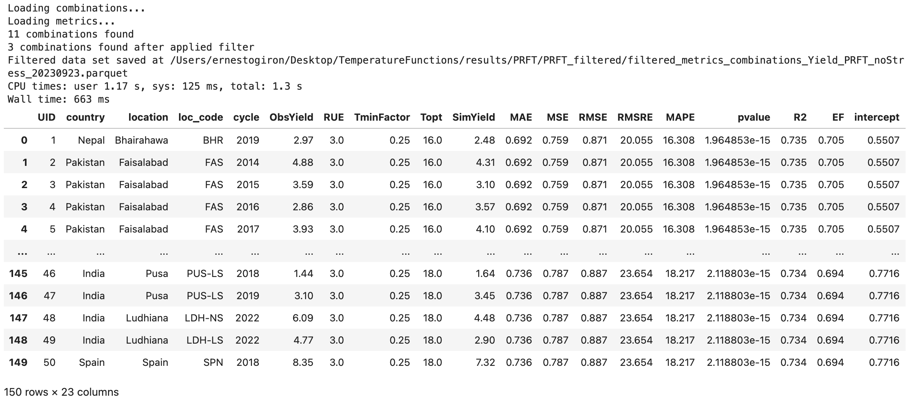
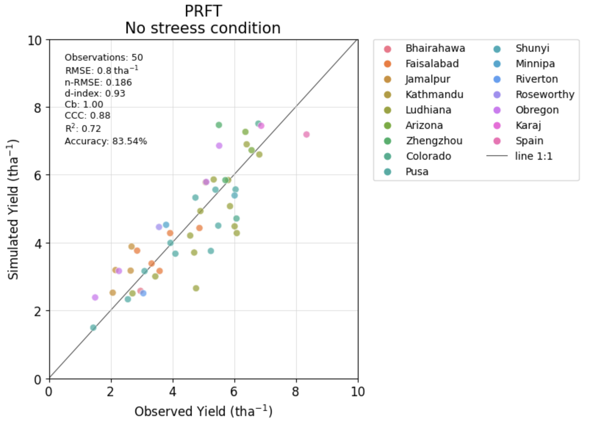
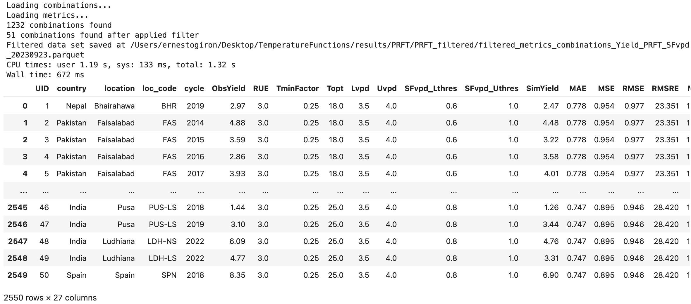
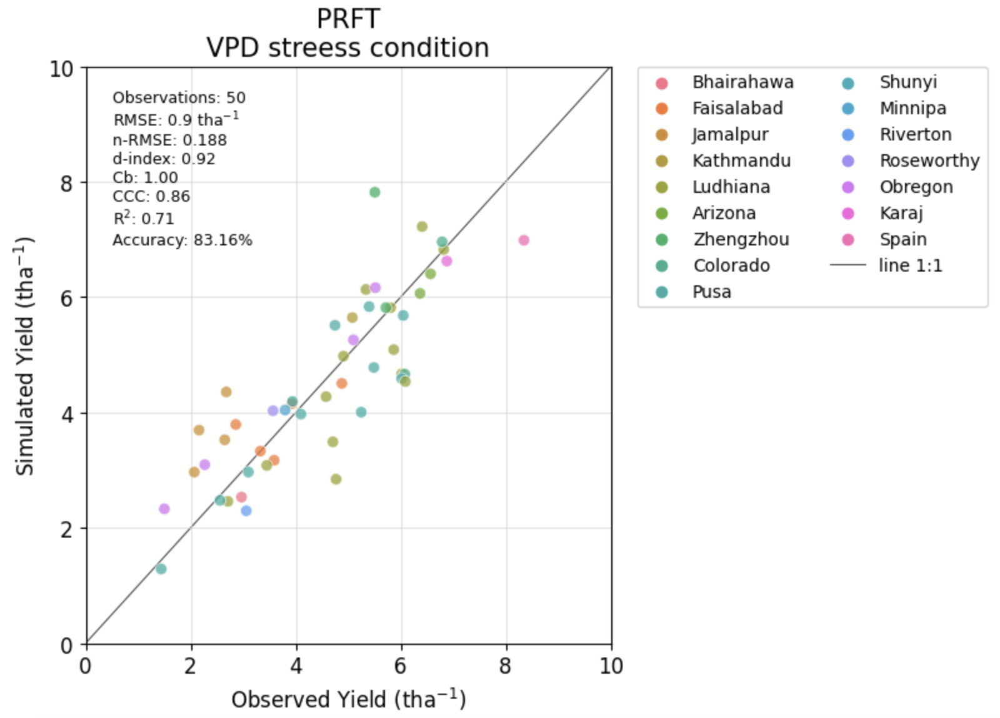

<!-- ---
hide:
  - navigation
  #- toc
--- -->
# Getting started

Here we compare three different temperature functions with different cardinal temperature combinations with and without VPD stress function for the period from heading to maturity (grain filling period). 

---

## Setup a folder

Enter a folder or subfolder of your project root where you created the python environment and activate it.
``` sh
cd <`subfolder`>
. venv/bin/activate
```
If you didn't install the `venv` yet, please review the detailed [installation instructions]

  [installation instructions]: installation.md

## Install library

Setting up temperature response functions is as simple as using the familiar `pip install` command. By executing the following line, you will have the library installed and ready to use:

``` sh
pip install tfunct
```

### Verify install
``` sh
python3 -c "import tfunct; print(tfunct.__version__)"
```

If a version similar to `tfunct version 1.0.0` is returned, you've installed the package successfully.
!!! Success  "Success: Temperature Response Functions package is now installed."

---

???+ example "View Sample quickstart for beginners"

    To get started with temperature response functions, we need to create a project folder and install a python virtual environment for our packages and further analysis as follows:
    
    === "macOS/Linux/Unix"

      ```sh
      mkdir TFUNCT_Project_2023;cd TFUNCT_Project_2023;
      python3 -m venv venv
      . venv/bin/activate
      pip install tfunct
      python3 -c "import tfunct; print(tfunct.__version__)"
      ```

???+ info "Google Colab"
    ### An easy way to learn and use temperature response functions package

    No install necessary, run the temperature response functions [tutorials] directly in the browser with [Colaboratory], a Google research project created to help disseminate machine learning education and research. It's a [Jupyter notebook] environment that requires no setup to use and runs entirely in the cloud.

      [tutorials]: #
      [Colaboratory]: https://colab.research.google.com/notebooks/welcome.ipynb
      [Jupyter notebook]: https://jupyter.org/

---

Note: this tutorial is also available as a single python notebook. You can download it on Github below:
[Download Python Notebook]()

Once tfunct library is successfully installed, you can import the essential modules for dataset creation and data pre-processing.

## Load a dataset <small>recommended for beginners</small> { #Load-a-dataset data-toc-label="Load a dataset" }

Load and prepare the trial dataset. 

### Loading the data { #loading-the-data data-toc-label="loading the data"}

Example dataset can be loaded directly from the library, as follows:

``` py hl_lines="2 4"
import tfunct
from tfunct.data import load_dataset # Function to load existing dataset
# Load example dataset (Phenology, NDVI and Weather data for each site)
data = load_dataset()
# Display available datasets
print(data.keys()) # ['Pheno', 'NDVI', 'Weather']
# Display Phenology
data['Pheno'].head()
```


``` python
# Display NDVI
data['NDVI'].head()
```


``` python
# Display Weather
data['Weather'].head()
```


## Creating a model

The model contains all of the required functions to analyse the data

``` python
# Load module to create a model
from tfunct.model import Model

# ------------------------
# MODEL CONFIGURATION
# ------------------------
# Define the Path where the output data will be stored
PATH_PRJ = '/Users/ernestogiron/Desktop/TemperatureFunctions/'
RESULTS_PATH = PATH_PRJ + 'results/'

config = {
    "PROJECT_PATH": PATH_PRJ,
    "RESULTS_PATH": RESULTS_PATH, #'./', # Results will be put in the same folder where the model is running
}

# Parameters used by default
parameters = dict(
                RUE = 3,
                DRYMATTER = 0.8,
                FACTOR_TON_HA = 0.01,
                YIELD_FACTOR = 0.8 * 0.01,
                TMIN_PERC_FACTOR = 0.25,
                NDVI_lowerThreshold = 0.16,
                Toptmin = 15,
                Topt = 18,
                Toptmax = 25,
                Tmin = 9,
                Tmax = 34,
                Lvpd = 1,
                Uvpd = 4,
                SFvpd_Lthres = 0.2,
                SFvpd_Uthres = 1,
            )

# create model to estimate grain yield
# model = Model(config, parameters) # Use this if you change any parameter above
model = Model(config)
# Preprocess datasets
model.preprocess_raw_datasets(data)

```

## Preparing locations

Prepare dataset to run all process in parallel using NDVIA GPU if available
``` python
sites = model.prepareData()
# Check for parameters of the first site
sites[0].attributes
```
``` raw
{'country': 'Nepal',
 'location': 'Bhairahawa',
 'loc_code': 'BHR',
 'lat': 27.5,
 'lon': 83.45,
 'cycle': 2019,
 'Days_To_Heading': 89,
 'Days_To_Maturity': 122,
 'ObsYield': 2.96685,
 'Sowing_date': '2018-11-26',
 'Heading_date': '2019-02-23',
 'Maturity_date': '2019-03-28',
 'UID': 1,
 'ndays_tmn_lt9': 1,
 'ndays_tmx_gt34': 0,
 'avg_Tdaymax': 24.578,
 'avg_NDVI': 0.447,
 'avg_iPAR': 0.369}

```

## Using one of the Temperature functions

Calculating grain yield using Ritchie's Temperature-based function affecting Photosynthetic Reduction Factor ([PRFT]).

  [PRFT]: prft.md

### No stress conditions
``` python
PRFT_noStress = model.getYield(sites=sites)
PRFT_noStress.head()
```


### Stressed VPD
``` python
PRFT_SFvpd = model.getYield(sites=sites, is_VPDStress=True)
PRFT_SFvpd.head()
```


For further information about `model.getYield` visit the [API reference](reference/index.md#tfunct.model.Model.getYield).


## Displaying Grain Yield

Create a figure to compare simulated grain yield against observed. 
``` python
from tfunct.util import figures

dirname=os.path.join(config['RESULTS_PATH'], 'PRFT', 'Figures')
figures.chart_compareResults(df_result=PRFT_noStress, fld1="ObsYield", fld2="SimYield", alpha=.75, s=45, xy_lim=2, 
                             hue='loc_code', loc_leg=2, ncol=2, ha='left', va='top',
                             title='PRFT\nNo streess condition', dirname=dirname, fname='PRFT_noStress', 
                             dispScore=True, dispLegend=True, saveFig=True, showFig=True, fmt='jpg')
```


Changing the parameter `df_result` to `PRFT_SFvpd`, you can see the results for VPD stress conditions
``` python
figures.chart_compareResults(df_result=PRFT_SFvpd, fld1="ObsYield", fld2="SimYield", alpha=.75, s=45, xy_lim=2,       
                             hue='loc_code', loc_leg=2, ncol=2, ha='left', va='top',
                             title='PRFT\nVPD streess condition', dirname=dirname, fname='PRFT_SFvpd', 
                             dispScore=True, dispLegend=True, saveFig=True, showFig=True, fmt='jpg')

```


If you prefer see both figures sid-by-side in a single one to compare results, you can use the `plot_corrTempFunct` function as follows:

``` python
figures.plot_corrTempFunct(cmb_noStress=PRFT_noStress, cmb_noStress_filtered=None, 
                           cmb_SFvpd=PRFT_SFvpd, cmb_SFvpd_filtered=None,
                           functype='PRFT',fld1='ObsYield',fld2='SimYield',hue='location', 
                           ncol=6, s=80, alpha=0.95, xy_lim=1, fonts_axes=10, fonts_titles=12, dispScore=True, errorbar=True, saveFig=True, showFig=True, path_to_save_results=path_to_save_results, dirname='Figures', fname='Fig_1_errorbar', fmt='jpg')
```


You can see the results for VPD stress condition are not so good; but you can improve the fitted model using different parameters when creating a model.

``` python
# Parameters adjusted 
parameters = dict(
                Topt = 16,
                Tmin = 7,
                Lvpd = 1,
                Uvpd = 4,
                SFvpd_Lthres = 0.2,
                SFvpd_Uthres = 1,
            )

# create model to estimate grain yield
model = Model(config, parameters)
```

## Estimating grain yield using several combinations in models

To establish the optimum temperature response for grain-filling period, you can run several models using a wide range of cardinal temperatures. 

!!! quote "Optimum temperature"
    The optimum temperature for photosynthesis depends on the choosen temperature function.

### PRFT combinations for none stress conditions
``` python
functype='PRFT'
isVPDStress=False
df_GYield, data_input, cols = model.setup_dataInput_forCombinations(sites) # Setup input data
# Combinations
RUE = [3.0] #[2.8, 2.9, 3.0, 3.1, 3.2]
Topt = [x for x in range(15, 26)]
TminFactor = [0.25] #[0.0, 0.1, 0.2, 0.25, 0.3, 0.4, 0.5]
# No stress conditions
array_params_to_run, array_results = model.getCombinations(functype=functype, cols=cols, RUE=RUE, Topt=Topt, 
                                                     TminFactor=TminFactor, isVPDStress=isVPDStress)

cmb_PRFT_noStress = model.getGYield_forCombinations(functype, df_GYield, data_input, array_params_to_run, 
                                           isVPDStress, array_results, saveFile=True)
```

#### Metrics for evaluation
``` python
m_PRFT_noStress = model.getCombinations_Metrics(functype, isVPDStress, df_GYield, 
                                                 array_params_to_run, array_results, saveFile=True) #, fmt='parquet')
m_PRFT_noStress
```


### PRFT combinations for stressed Vapor pressure deficit (VPD) condition

``` python
functype='PRFT'
isVPDStress=True
df_GYield, data_input, cols = model.setup_dataInput_forCombinations(sites) # Setup input data
# Combinations
RUE = [3.0]
Topt = [x for x in range(15, 26)]
TminFactor = [0.25] #[0.0, 0.1, 0.2, 0.25, 0.3, 0.4, 0.5]
Lvpd = [0.5, 1, 1.5, 2, 2.5, 3, 3.5]
Uvpd = [1, 1.5, 2, 2.5, 3, 3.5, 4]
SFvpd_Lthres = [0.2, 0.4, 0.6, 0.8] 
SFvpd_Uthres = [1]
# No stress conditions
array_params_to_run, array_results = model.getCombinations(functype=functype, cols=cols, RUE=RUE, Topt=Topt, TminFactor=TminFactor,  
                                                           Lvpd=Lvpd, Uvpd=Uvpd, SFvpd_Lthres=SFvpd_Lthres, SFvpd_Uthres=SFvpd_Uthres,
                                                           isVPDStress=isVPDStress)

cmb_PRFT_SFvpd = model.getGYield_forCombinations(functype, df_GYield, data_input, array_params_to_run, 
                                           isVPDStress, array_results, saveFile=True)
``` 

#### Metrics for VPD stress condition
``` python
m_PRFT_SFvpd = model.getCombinations_Metrics(functype, isVPDStress, df_GYield, 
                                                 array_params_to_run, array_results, saveFile=True)
m_PRFT_SFvpd
```


### Display grain yield comparison with and without VPD stress
``` python
figures.plot_corrTempFunct(cmb_noStress=cmb_PRFT_noStress, cmb_noStress_filtered=cmb_PRFT_noStress, 
                   cmb_SFvpd=cmb_PRFT_SFvpd, cmb_SFvpd_filtered=cmb_PRFT_SFvpd,
                   functype='PRFT',fld1='ObsYield',fld2='SimYield',hue='location', ncol=6, s=20, alpha=0.65, xy_lim=1, 
                   fonts_axes=10, fonts_titles=12, dispScore=True, errorbar=False, saveFig=True, showFig=True,
                   path_to_save_results=path_to_save_results, dirname='Figures', fname='Fig_2_nofilters', fmt='jpg')
```


``` python
figures.plot_corrTempFunct(cmb_noStress=cmb_PRFT_noStress, cmb_noStress_filtered=cmb_PRFT_noStress, 
                   cmb_SFvpd=cmb_PRFT_SFvpd, cmb_SFvpd_filtered=cmb_PRFT_SFvpd,
                   functype='PRFT',fld1='ObsYield',fld2='SimYield',hue='location', ncol=6, s=80, alpha=0.95, xy_lim=1, 
                   fonts_axes=10, fonts_titles=12, dispScore=True, errorbar=True, saveFig=True, showFig=True,
                   path_to_save_results=path_to_save_results, dirname='Figures', fname='Fig_2_nofilters_errorbar', fmt='jpg')
```


## Select the best results using filters

After running several models you can filter results to see which one look better. 

!!! example "Example of filter"

    The following table is an example of one filter used to evaluate the best models, it only uses three (3) evaluation metrics (_Cb, CCC, and RMSRE_) to select the top ones. 

    | Temperature Function | Cb  | CCC  |  RMSRE |   |
    |---------------------|---|---|---|---|
    | **PRFT** |  0.98 |  > 0.8 |    |   |
    | **PRFT vpd stress**|  0.98 | > 0.8  | < 22  |   |

When the combinations file is small you can filter directly in your session. For example:
``` python
m_PRFT_noStress[(m_PRFT_noStress['Cb']>0.98) & (m_PRFT_noStress['CCC']>0.80) ]
```


``` python
m_PRFT_SFvpd[(m_PRFT_SFvpd['Cb']>0.98) & (m_PRFT_SFvpd['CCC']>0.80) & (m_PRFT_SFvpd['RMSRE']<22)]
```


But when the combinations dataset is huge, you will have memory issues. Then the best way to filter the combinations in an easy way, is using the `util.filterSimulations` function, as follows:
``` python
# Load filter function to accelerate the responses
from tfunct.util import filterSimulations

```

### No stress conditions
``` python
%%time
# path of the combinations and metrics files in parquet format
c_PRFT = os.path.join(config['RESULTS_PATH'], "PRFT", "PRFT_noStress", "combinations_Yield_PRFT_noStress.parquet")
m_PRFT = os.path.join(config['RESULTS_PATH'], "PRFT", "PRFT_noStress", "metrics_Yield_PRFT_noStress.parquet")
# Filters
cmb_filters = dict(
                RUE = ('RUE', '=', 3.0 ),
                TminFactor = ('TminFactor', '=', 0.25 )
            )
met_filters = dict(
        Cb = ('>', 0.98),
        CCC = ('>', 0.80)
    )
outputPath = os.path.join(config['RESULTS_PATH'], "PRFT")

# Use pdFormat=True to display filtered table. Use when the results are small to avoid freeze you computer session
# Use fmt='parquet' and avoid fmt='csv' when the results are quite large.
# Use dispFig=True if the filtered table is small.
filtered_c_PRFT = filterSimulations(functype='PRFT', VPDstress=False, cmb=c_PRFT, met=m_PRFT, 
                                 cmb_filters=cmb_filters, met_filters=met_filters, pdFormat=True, 
                                 dispFig=True, saveFig=True, figname='Fig_topComb_avgYield', figfmt='pdf',
                                 saveResults=True, outputPath=outputPath, fmt='parquet')

filtered_c_PRFT
```



### VPD stress conditions
``` python
# Path of the combinations and metrics files
c_PRFT_SFvpd = os.path.join(config['RESULTS_PATH'], "PRFT", "PRFT_SFvpd", "combinations_Yield_PRFT_SFvpd.parquet")
m_PRFT_SFvpd = os.path.join(config['RESULTS_PATH'], "PRFT", "PRFT_SFvpd", "metrics_Yield_PRFT_SFvpd.parquet")
cmb_filters = dict(
                RUE = ('RUE', '=', 3.0 ),
                TminFactor = ('TminFactor', '=', 0.25 )
            )
met_filters = dict(
        Cb = ('>', 0.98),
        CCC = ('>', 0.80)
    )
outputPath = os.path.join(config['RESULTS_PATH'], "PRFT") 

# Use pdFormat=True to display filtered table. Use when the results are small to avoid freeze you computer session
# Use fmt='parquet' and avoid fmt='csv' when the results are quite large.
# Use dispFig=True if the filtered table is small.
filtered_c_PRFT_SFvpd = filterSimulations(functype='PRFT', VPDstress=True, cmb=c_PRFT_SFvpd, met=m_PRFT_SFvpd, 
                                 cmb_filters=cmb_filters, met_filters=met_filters, pdFormat=True, 
                                 dispFig=True, saveFig=True, figname='Fig_topComb_avgYield', figfmt='pdf',
                                 saveResults=True, outputPath=outputPath, fmt='parquet')

filtered_c_PRFT_SFvpd
```



### Checking selected combinations side-by-side

Displaying grain yield comparison with and without VPD stress for the best combinations.

``` python
figures.plot_corrTempFunct(cmb_noStress=filtered_c_PRFT, cmb_noStress_filtered=filtered_c_PRFT, 
                           cmb_SFvpd=filtered_c_PRFT_SFvpd, cmb_SFvpd_filtered=filtered_c_PRFT_SFvpd,
                   functype='PRFT',fld1='ObsYield',fld2='SimYield',hue='location', ncol=6, s=40, alpha=0.95, xy_lim=1, 
                   fonts_axes=10, fonts_titles=12, dispScore=True, errorbar=False, saveFig=True, showFig=True,
                   path_to_save_results=path_to_save_results, dirname='Figures', fname='Fig_2_filtered', fmt='jpg')
```


``` python
figures.plot_corrTempFunct(cmb_noStress=filtered_c_PRFT, cmb_noStress_filtered=filtered_c_PRFT, 
                           cmb_SFvpd=filtered_c_PRFT_SFvpd, cmb_SFvpd_filtered=filtered_c_PRFT_SFvpd,
                   functype='PRFT',fld1='ObsYield',fld2='SimYield',hue='location', ncol=6, s=80, alpha=0.95, xy_lim=1, 
                   fonts_axes=10, fonts_titles=12, dispScore=True, errorbar=True, saveFig=True, showFig=True,
                   path_to_save_results=path_to_save_results, dirname='Figures', fname='Fig_2_filtered_errorbar', fmt='jpg')
```


## Conclusion


!!! success "Congratulations"

    You have run a simulation using a prebuilt dataset and the [Temperature Functions API](reference/index.md).


