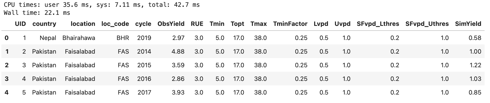
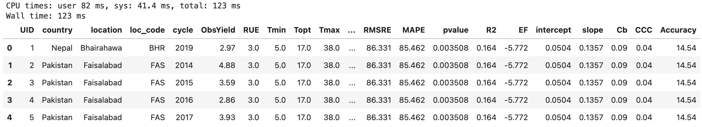

# Querying Temperature response functions combinations with precision using DuckDB

## DuckDB

[DuckDB], a free and open source analytical data management system, can run SQL queries directly on Parquet files and automatically take advantage of the advanced features of the Parquet format. [Apache Parquet] is the most common “Big Data” storage format for analytics.

The Parquet format has a number of properties that make it suitable for analytical use cases[^1]:

* The columnar representation means that individual columns can be (efficiently) read. No need to always read the entire file!
* The file contains per-column statistics in every row group (min/max value, and the number of `NULL` values). These statistics allow the reader to skip row groups if they are not required.
* The columnar compression significantly reduces the file size of the format, which in turn reduces the storage requirement of data sets. This can often turn Big Data into Medium Data.


    [DuckDB]: https://duckdb.org/
    [Apache Parquet]: https://www.databricks.com/glossary/what-is-parquet


DuckDB’s zero-dependency Parquet reader is able to directly execute SQL queries on Parquet files without any import or analysis step. Because of the natural columnar format of Parquet, this is very fast!

DuckDB will read the Parquet files in a streaming fashion, which means you can perform queries on large Parquet files that do not fit in your main memory.

DuckDB is able to automatically detect which columns and rows are required for any given query. This allows users to analyze much larger and more complex Parquet files without needing to perform manual optimizations or investing in more hardware.

The most of the Temperature function results are saved in parquet format, so we can take advantage of this powerful library in our pipeline as follows:

## Load and configure library
``` python
# to install: pip install duckdb
import duckdb

# some DuckDB setup 
con = duckdb.connect()
# enable automatic query parallelization
con.execute("PRAGMA threads=2")
# enable caching of parquet metadata
con.execute("PRAGMA enable_object_cache")
```

## First query

Now suppose we want to figure out how many rows are in our data set. We can do that using the following code snippets.

### Display the number of combinations in TPF simulations
``` python
print(duckdb.query('''
SELECT COUNT(*)
FROM 'results/WETF/WETF_SFvpd/combinations_Yield_WETF_SFvpd.parquet'
''').fetchall())

```

## Filter dataset

We can filter the big files easily as follows:

``` python
print(duckdb.query('''
SELECT COUNT(*)
FROM 'results/WETF/WETF_SFvpd/combinations_Yield_WETF_SFvpd.parquet' 
WHERE RUE = 3.0 AND TminFactor= 0.25 AND Topt BETWEEN 16.0 AND 18
''').fetchall())
```

### Display result in a table or pandas dataframe

``` python
%%time
con.execute("SELECT * FROM FROM 'results/WETF/WETF_SFvpd/combinations_Yield_WETF_SFvpd.parquet' LIMIT 5").df()
```


DuckDB completes the query very quickly, as it automatically recognizes what needs to be read from the Parquet file and minimizes the required reads.

### Join combinations and metrics results in one table
``` python
%%time
con.execute("SELECT * \
FROM 'results/WETF/WETF_SFvpd/combinations_Yield_WETF_SFvpd.parquet', \
'results/WETF/WETF_SFvpd/metrics_Yield_WETF_SFvpd.parquet' \
WHERE UID = UID LIMIT 5").df()

```


## Conclusion

DuckDB can efficiently run queries directly on top of Parquet files without requiring an initial loading phase. The system will automatically take advantage of all of Parquet’s advanced features to speed up query execution.


  [^1]: Taken from DuckDB (https://duckdb.org/2021/06/25/querying-parquet.html). (Accessed on 01-Oct-2023)
