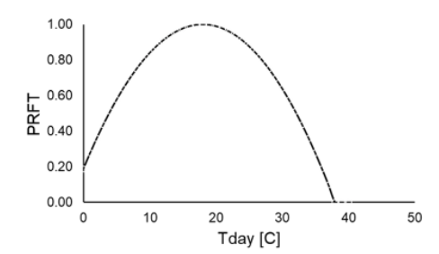
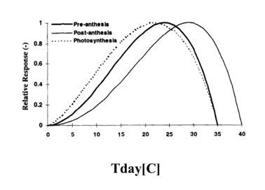
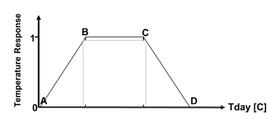
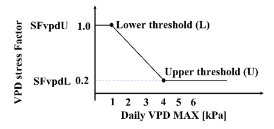

# Temperature Functions

We analyse how different temperature functions and VPD thresholds affects non-water stress wheat yield across the International Wheat Improvement Network (IWIN) sites and the other locations across the globe.

Different temperature response functions could predict wheat yield across various locations. 
The suggested yield algorithm based on different temperature functions could predict wheat yield with high accuracy across various locations around the world.

## Photosynthetic Reduction Factor ([PRFT])

Calculating grain yield using Ritchie's Temperature-based function affecting Photosynthetic Reduction Factor ([PRFT])[^1]

  [PRFT]: prft.md

## The Wang–Engel temperature function ([WETF])

Calculating grain yield using The Wang–Engel's Temperature-based function ([WETF])[^2]

  [WETF]: weft.md

## The Trapezoidal Temperature Function ([TPF])

Calculating grain yield using The Trapezoidal Temperature-based function ([TPF])[^3]

  [TPF]: tpf.md

## Vapor Pressure Deficit (VPD) stress factor

To find the right combinations of VPD stress factor, based on the literature we assume that. 

<math xmlns="http://www.w3.org/1998/Math/MathML">
  <mfenced mathcolor="#000000" open="{" close="" separators="|">
    <mrow>
      <mtable mathcolor="#000000">
        <mtr>
          <mtd>
            <mrow>
              <maligngroup/>
              <mi mathcolor="#000000">S</mi>
              <mi mathcolor="#000000">F</mi>
              <mi mathcolor="#000000">v</mi>
              <mi mathcolor="#000000">p</mi>
              <mi mathcolor="#000000">d</mi>
              <mi mathcolor="#000000">U</mi>
              <mi mathcolor="#000000"> </mi>
              <mi mathcolor="#000000"> </mi>
              <mi mathcolor="#000000"> </mi>
              <mi mathcolor="#000000"> </mi>
              <mi mathcolor="#000000"> </mi>
              <mi mathcolor="#000000"> </mi>
              <mi mathcolor="#000000"> </mi>
              <mi mathcolor="#000000"> </mi>
              <mi mathcolor="#000000"> </mi>
              <mi mathcolor="#000000"> </mi>
              <mi mathcolor="#000000"> </mi>
              <mi mathcolor="#000000"> </mi>
              <mi mathcolor="#000000"> </mi>
              <mi mathcolor="#000000"> </mi>
              <mi mathcolor="#000000">f</mi>
              <mi mathcolor="#000000">o</mi>
              <mi mathcolor="#000000">r</mi>
              <mi mathcolor="#000000"> </mi>
              <mi mathcolor="#000000"> </mi>
              <mi mathcolor="#000000"> </mi>
              <mi mathcolor="#000000"> </mi>
              <mi mathcolor="#000000"> </mi>
              <msub>
                <mrow>
                  <mn mathcolor="#000000">0</mn>
                  <mo mathcolor="#000000">&lt;</mo>
                  <mi mathcolor="#000000">V</mi>
                  <mi mathcolor="#000000">P</mi>
                  <mi mathcolor="#000000">D</mi>
                </mrow>
                <mrow>
                  <mi mathcolor="#000000">m</mi>
                  <mi mathcolor="#000000">a</mi>
                  <mi mathcolor="#000000">x</mi>
                </mrow>
              </msub>
              <mo mathcolor="#000000">≤</mo>
              <mi mathcolor="#000000">V</mi>
              <mi mathcolor="#000000">P</mi>
              <mi mathcolor="#000000">D</mi>
              <mi mathcolor="#000000">L</mi>
              <mi mathcolor="#000000"> </mi>
            </mrow>
          </mtd>
        </mtr>
        <mtr>
          <mtd>
            <mrow>
              <maligngroup/>
              <mi mathcolor="#000000"> </mi>
              <mi mathcolor="#000000"> </mi>
              <mi mathcolor="#000000"> </mi>
              <mi mathcolor="#000000"> </mi>
              <mi mathcolor="#000000"> </mi>
              <mn mathcolor="#000000">1</mn>
              <mo mathcolor="#000000">-</mo>
              <mfrac mathcolor="#000000">
                <mrow>
                  <msub>
                    <mrow>
                      <mi mathcolor="#000000">V</mi>
                      <mi mathcolor="#000000">P</mi>
                      <mi mathcolor="#000000">D</mi>
                    </mrow>
                    <mrow>
                      <mi mathcolor="#000000">m</mi>
                      <mi mathcolor="#000000">a</mi>
                      <mi mathcolor="#000000">x</mi>
                    </mrow>
                  </msub>
                  <mo mathcolor="#000000">-</mo>
                  <mi mathcolor="#000000">V</mi>
                  <mi mathcolor="#000000">P</mi>
                  <mi mathcolor="#000000">D</mi>
                  <mi mathcolor="#000000">L</mi>
                </mrow>
                <mrow>
                  <mi mathcolor="#000000">V</mi>
                  <mi mathcolor="#000000">P</mi>
                  <mi mathcolor="#000000">D</mi>
                  <mi mathcolor="#000000">U</mi>
                  <mo mathcolor="#000000">±</mo>
                  <mn mathcolor="#000000">0.6</mn>
                  <mo mathcolor="#000000">-</mo>
                  <mi mathcolor="#000000">V</mi>
                  <mi mathcolor="#000000">P</mi>
                  <mi mathcolor="#000000">D</mi>
                  <mi mathcolor="#000000">L</mi>
                </mrow>
              </mfrac>
              <mi mathcolor="#000000"> </mi>
              <mi mathcolor="#000000"> </mi>
              <mi mathcolor="#000000"> </mi>
              <mi mathcolor="#000000"> </mi>
              <mi mathcolor="#000000"> </mi>
              <mi mathcolor="#000000">f</mi>
              <mi mathcolor="#000000">o</mi>
              <mi mathcolor="#000000">r</mi>
              <mi mathcolor="#000000"> </mi>
              <mi mathcolor="#000000"> </mi>
              <mi mathcolor="#000000"> </mi>
              <mi mathcolor="#000000"> </mi>
              <mi mathcolor="#000000">V</mi>
              <mi mathcolor="#000000">P</mi>
              <mi mathcolor="#000000">D</mi>
              <mi mathcolor="#000000">L</mi>
              <mo mathcolor="#000000">&lt;</mo>
              <msub>
                <mrow>
                  <mi mathcolor="#000000">V</mi>
                  <mi mathcolor="#000000">P</mi>
                  <mi mathcolor="#000000">D</mi>
                </mrow>
                <mrow>
                  <mi mathcolor="#000000">m</mi>
                  <mi mathcolor="#000000">a</mi>
                  <mi mathcolor="#000000">x</mi>
                </mrow>
              </msub>
              <mo mathcolor="#000000">≤</mo>
              <mi mathcolor="#000000">V</mi>
              <mi mathcolor="#000000">P</mi>
              <mi mathcolor="#000000">D</mi>
              <mi mathcolor="#000000">U</mi>
            </mrow>
          </mtd>
        </mtr>
        <mtr>
          <mtd>
            <mrow>
              <maligngroup/>
              <mi mathcolor="#000000">S</mi>
              <mi mathcolor="#000000">F</mi>
              <mi mathcolor="#000000">v</mi>
              <mi mathcolor="#000000">p</mi>
              <mi mathcolor="#000000">d</mi>
              <mi mathcolor="#000000">L</mi>
              <mi mathcolor="#000000"> </mi>
              <mi mathcolor="#000000"> </mi>
              <mi mathcolor="#000000"> </mi>
              <mi mathcolor="#000000"> </mi>
              <mi mathcolor="#000000"> </mi>
              <mi mathcolor="#000000"> </mi>
              <mi mathcolor="#000000"> </mi>
              <mi mathcolor="#000000"> </mi>
              <mi mathcolor="#000000"> </mi>
              <mi mathcolor="#000000"> </mi>
              <mi mathcolor="#000000"> </mi>
              <mi mathcolor="#000000"> </mi>
              <mi mathcolor="#000000">f</mi>
              <mi mathcolor="#000000">o</mi>
              <mi mathcolor="#000000">r</mi>
              <mi mathcolor="#000000"> </mi>
              <mi mathcolor="#000000"> </mi>
              <mi mathcolor="#000000"> </mi>
              <mi mathcolor="#000000"> </mi>
              <mi mathcolor="#000000"> </mi>
              <msub>
                <mrow>
                  <mi mathcolor="#000000">V</mi>
                  <mi mathcolor="#000000">P</mi>
                  <mi mathcolor="#000000">D</mi>
                </mrow>
                <mrow>
                  <mi mathcolor="#000000">m</mi>
                  <mi mathcolor="#000000">a</mi>
                  <mi mathcolor="#000000">x</mi>
                </mrow>
              </msub>
              <mo mathcolor="#000000">&gt;</mo>
              <mi mathcolor="#000000">V</mi>
              <mi mathcolor="#000000">P</mi>
              <mi mathcolor="#000000">D</mi>
              <mi mathcolor="#000000">U</mi>
              <mi mathcolor="#000000"> </mi>
              <mi mathcolor="#000000"> </mi>
              <mi mathcolor="#000000"> </mi>
              <mi mathcolor="#000000"> </mi>
              <mi mathcolor="#000000"> </mi>
              <mi mathcolor="#000000"> </mi>
              <mi mathcolor="#000000"> </mi>
              <mi mathcolor="#000000"> </mi>
              <mi mathcolor="#000000"> </mi>
              <mi mathcolor="#000000"> </mi>
              <mi mathcolor="#000000"> </mi>
            </mrow>
          </mtd>
        </mtr>
      </mtable>
    </mrow>
  </mfenced>
</math>

Where:

- SFvpdU = 1 means no VPD stress 
- SFvpdL =  (0.2, 0.4, 0.6, 0.8)

  [^1]: Type 1 - One cardinal temperature. Topt  (15:25 °C).
  [^2]: Type 2 - Three cardinal temperatures. Tmin (0:9°C); Topt (15:25°C); and Tmax (30:50°C).
  [^3]: Type 3 - Four cardinal temperatures. Tmin (0:5°C); Topt_min (5:25°C); Topt_max (15:45°C); and Tmax (35:50°C).
